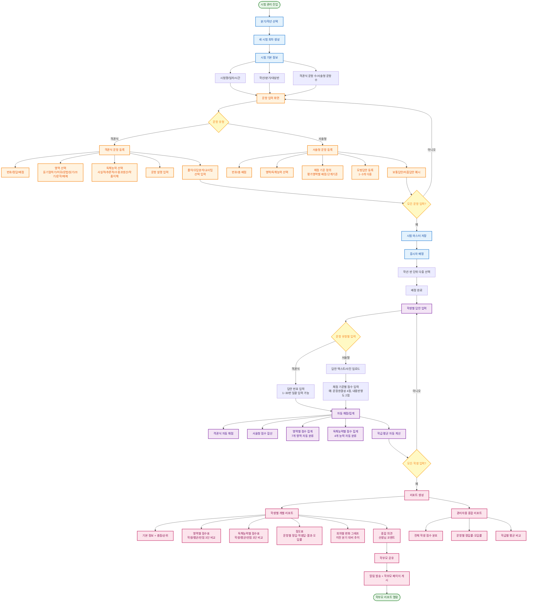

# 시험 관리 시스템 상세 기획 v2.0 (실제 운영 자료 반영)

## 📌 문서 목적

이 문서는 v1.0 기획안의 시험 관리 부분을 **실제 운영 중인 엑셀 시스템과 시험 자료**를 바탕으로 전면 보강한 것입니다.
업로드된 자료(2026년 2분기 문해력 진단평가)를 분석하여 다음과 같은 핵심 구조를 발견했습니다.

---

## 1. 현재 운영 중인 시스템 분석

### 1-1. 발견된 핵심 구조

| 영역 | 현재 운영 방식 | 시스템 반영 필요사항 |
|------|--------------|------------------|
| **분기별 시험** | 매 분기마다 별도 시험 (예: 1분기, 2분기) | 분기 개념을 시험 회차의 상위 단위로 도입 |
| **이중 분류** | 영역(7개) × 독해능력(4개) 두 축으로 문항 분류 | 모든 문항이 두 가지 분류값을 가지도록 설계 |
| **문항 메타데이터** | 정답·배점·영역·독해능력·문항설명·풀이·오답분석·교사팁 | 풀이/오답분석/교사팁까지 저장 가능하도록 확장 |
| **서술형 채점** | 평가영역별 세부 채점 기준 (예: 문장완결성 4점 + 내용반영도 4점 + 맞춤법 2점) | 세부 평가 기준을 자유롭게 정의·채점할 수 있어야 함 |
| **모범답안** | 객관식 정답 + 서술형 모범답안 1~2개 + 보통답안/미흡답안 | 서술형은 다단계 모범답안 등록 가능해야 함 |
| **성적 비교** | 학생점수 vs 만점 vs 학급 평균 | 자동 평균 계산 + 학생-평균-만점 3단 비교 |
| **상세 분석** | 영역별 점수 + 독해능력별 점수 (이중 집계) | 한 번의 답안 입력으로 두 축 모두 자동 집계 |

### 1-2. 실제 시험 데이터 예시 (2026년 2분기 / 초등 이서)

#### 시험 기본 정보
- 시험명: 26년 2분기 문해력 진단평가
- 대상: 초등학교 1-2학년
- 시험 시간: 60분
- 총 문항: 30문항(객관식, 100점) + 4문항(서술형, 50점) = **34문항 / 150점 만점**

#### 영역(7개) 분류 - 국어과 핵심 영역
듣기말하기, 어휘, 문법, 읽기, 쓰기, 문학, 매체

#### 독해능력(4개) 분류 - 문해력 수준 분석
사실적 독해, 추론적 독해, 수용과 생산, 작품이해

#### 문항별 데이터 구조 (예: 1번 문항)
| 항목 | 값 |
|------|---|
| 번호 | 1 |
| 정답 | ① |
| 배점 | 3점 |
| 영역 | 듣기말하기 |
| 독해능력 | 사실적 독해 |
| 문항 설명 | 대화에서 알 수 있는 내용 파악 |
| 풀이 | 선생님이 '채소가 다 자라기 전에 뽑으면 안 돼요'라고 분명히 말씀하셨으므로... |
| 오답 분석 | ② 방울토마토와 상추를 심을 것이다 → ○ (선생님이 직접 말씀함) ... |
| 교사 팁 | 대화를 읽고 사실을 파악하는 문항입니다. 선생님의 말씀 중 금지 표현... |

#### 서술형 채점 기준 예시 (31번 - 그림 묘사 문장 쓰기, 10점)
| 평가 영역 | 배점 | 채점 기준 |
|----------|------|---------|
| 문장 완결성 | 4점 | 4점: 주어와 서술어가 모두 갖춰진 완전한 문장 / 2점: 주어 또는 서술어 중 하나만 / 0점: 문장 형태 미달 |
| 내용 반영도 | 4점 | 4점: 그림의 핵심 내용 모두 반영 / 2점: 일부만 / 0점: 무관 |
| 맞춤법·띄어쓰기 | 2점 | 2점: 정확함 / 1점: 오류 1개 / 0점: 오류 2개 이상 |

→ 시스템은 **세부 항목별로 점수 입력**이 가능해야 함

---

## 2. 업데이트된 시험 데이터 모델

### 2-1. 엔티티 관계

```
시험 회차 (Exam)
├── 시험 정보 (분기, 학년, 일자, 총점, 시험시간)
├── 문항 (Question) [1:N]
│   ├── 객관식 정보 (정답, 배점, 영역, 독해능력, 문항설명)
│   ├── 풀이/오답분석/교사팁 (선택)
│   └── 서술형 채점 기준 (Rubric) [1:N]
│       ├── 평가 영역명 (예: 문장 완결성)
│       ├── 배점
│       ├── 단계별 기준 (예: 4점/2점/0점)
│       └── 모범 답안 (다중 등록 가능)
├── 응시자 (Examinee) [1:N]
│   ├── 학생 정보
│   ├── 객관식 답안 (Question별)
│   ├── 서술형 답안 (Question별 + Rubric별 점수)
│   ├── 자동 채점 결과
│   └── 종합의견 (선생님 코멘트)
└── 분석 리포트 [자동 생성]
    ├── 영역별 점수 (학생/평균/만점)
    ├── 독해능력별 점수 (학생/평균/만점)
    ├── 정오표 (문항별 결과)
    └── 회차별 추이 (1분기 → 2분기 → 3분기 ...)
```

### 2-2. 핵심 데이터 항목

#### 시험(Exam) 테이블
- 시험 ID, 시험명, 학년, 분기, 시험 일자, 시험 시간(분), 객관식 총점, 서술형 총점, 상태(작성중/응시중/채점중/공유완료)

#### 문항(Question) 테이블
- 문항 ID, 시험 ID, 문항 번호, 문항 유형(객관식/서술형)
- **객관식 한정**: 정답 번호, 선택지 수
- **공통**: 배점, 영역(7개 중 1개), 독해능력(4개 중 1개), 문항 설명
- 풀이(text), 오답 분석(text), 교사 팁(text), 문항 이미지(첨부)

#### 서술형 채점 기준(Rubric) 테이블 - 새로 추가
- 기준 ID, 문항 ID, 평가 영역명, 배점, 단계별 채점 기준(JSON 또는 텍스트)
- 모범 답안(다중)

#### 응시자 답안(Answer) 테이블
- 답안 ID, 응시자 ID, 문항 ID
- **객관식**: 학생 답안 번호, 정오, 획득 점수 (자동)
- **서술형**: 학생 답안(text/사진), Rubric별 부여 점수(JSON), 합계 점수

---

## 3. 업데이트된 시험 관리 흐름도



---

## 4. 업데이트된 화면 정의 (시험 영역)

### S-1. 시험 회차 관리 (목록)
| 항목 | 내용 |
|------|------|
| **목적** | 분기별/학년별 시험 회차 통합 관리 |
| **주요 구성** | 분기 필터, 학년 필터, 시험 카드(시험명·일자·응시자 수·상태), 신규 생성 버튼 |
| **상태 표시** | 작성중(노란) / 응시중(파란) / 채점중(주황) / 공유완료(초록) |

### S-2. 시험 회차 생성 - 기본 정보
| 항목 | 내용 |
|------|------|
| **목적** | 새 시험의 기본 정보 입력 |
| **주요 구성** | 시험명, 학년, 분기 선택, 시험 일자, 시험 시간(분), 객관식/서술형 문항 수 사전 입력 |
| **다음** | 문항 입력 화면으로 이동 |

### S-3. 객관식 문항 입력
| 항목 | 내용 |
|------|------|
| **목적** | 객관식 문항 정보를 표 형태로 빠르게 입력 |
| **주요 구성** | 번호 / 정답 / 배점 / **영역 드롭다운(7개)** / **독해능력 드롭다운(4개)** / 문항 설명 / [상세 입력 펼치기] 버튼 |
| **상세 입력** | 풀이, 오답 분석, 교사 팁(접혀 있다가 클릭 시 펼침) |
| **편의 기능** | 엑셀 붙여넣기 지원, 영역/독해능력 드롭다운 자동 추천 |

### S-4. 서술형 문항 입력 (신규 추가)
| 항목 | 내용 |
|------|------|
| **목적** | 서술형 문항과 다단계 채점 기준 등록 |
| **주요 구성** | 번호, 총 배점, 영역/독해능력, 문제 본문, **채점 기준 추가 버튼** |
| **채점 기준 항목** | 평가 영역명 + 배점 + 단계별 기준 텍스트 (예: 4점/2점/0점 각 설명) |
| **모범 답안** | 모범답안 1, 모범답안 2, 보통답안, 미흡답안 4단계 입력 |
| **검증** | 채점 기준 배점 합계 = 총 배점 자동 검증 |

### S-5. 객관식 답안 입력 (스피드 모드)
| 항목 | 내용 |
|------|------|
| **목적** | 30개 답안을 빠르게 입력 (현재 엑셀과 동일한 속도 보장) |
| **주요 구성** | 학생 선택 → 1번부터 30번까지 답안 번호만 빠르게 입력 (1, 3, 2, 4, ...) |
| **편의 기능** | 키보드 숫자키만으로 입력, 자동 다음 칸 이동, 채점 결과 즉시 색상 표시 |

### S-6. 서술형 채점 화면 (신규 추가)
| 항목 | 내용 |
|------|------|
| **목적** | 서술형 답안을 평가 기준별로 채점 |
| **주요 구성** | 학생 답안(텍스트 또는 사진), 채점 기준 체크박스/점수 입력, 모범답안 참조 패널 |
| **편의 기능** | 모범답안과 학생답안 좌우 비교 보기, 채점 기준별 단계 클릭 시 자동 점수 부여 |

### S-7. 학생 개별 리포트 (실제 양식 반영)

현재 엑셀 "샘플" 시트의 양식을 그대로 디지털화:

**리포트 구성**
1. **기본 정보**: 이름, 학교, 학년, 진로 목표, 반 배정
2. **시험 성적**: 총점 / 학생점수 / 평균 (3단 비교)
3. **영역별 점수표** (7개 영역)
   - 영역명 / 만점 / 평균 / 학생점수
   - 듣기말하기 / 어휘 / 문법 / 읽기 / 쓰기 / 문학 / 매체
4. **영역별 점수 (백분위)** - 시각화
5. **수준별 점수** (4개 독해능력)
   - 사실적 독해 / 추론적 독해 / 수용과 생산 / 작품이해
   - 만점 / 평균 / 학생점수
6. **수준별 점수 (백분위)** - 시각화
7. **정오표** (모든 문항)
   - 문제번호 / 정답 / 작성한 답 / 결과(O/X) / 오답률 / 영역 / 독해능력 / 문항 설명
8. **종합 의견** (선생님 자유 입력)

### S-8. 회차별 추이 분석 (신규 강화)
| 항목 | 내용 |
|------|------|
| **목적** | 같은 학생의 분기별 변화를 한눈에 확인 |
| **주요 구성** | X축: 분기(1분기→2분기→3분기→4분기), Y축: 점수 |
| **그래프** | 총점 라인, 영역별 라인(7개 색상), 독해능력별 라인(4개 색상) |
| **인사이트** | "어휘는 향상, 문법은 유지, 추론적 독해는 하락" 같은 자동 코멘트 |

---

## 5. 업데이트된 비즈니스 규칙 (시험 영역)

| 규칙 ID | 규칙명 | 조건 | 결과 |
|--------|-------|------|------|
| BR-E01 | 영역·독해능력 필수 | 모든 문항 등록 시 | 영역(7개)과 독해능력(4개)을 모두 선택해야 저장 가능 |
| BR-E02 | 서술형 채점 기준 필수 | 서술형 문항 등록 시 | 최소 1개의 채점 기준 등록 필수 |
| BR-E03 | 채점 기준 배점 합 검증 | 서술형 저장 시 | 채점 기준의 배점 합 = 문항 총 배점이어야 저장 가능 |
| BR-E04 | 객관식 자동 채점 | 답안 입력 시 | 정답과 비교하여 즉시 채점 + 영역/독해능력별 자동 집계 |
| BR-E05 | 서술형 부분 점수 | 채점 기준별 점수 입력 | 합계 = 학생 획득 점수, 모든 기준 입력 시까지 미완료 표시 |
| BR-E06 | 결시 처리 | 학생이 응시하지 않음 | "결시"로 표시, 평균 계산에서 제외 |
| BR-E07 | 학급 평균 자동 계산 | 응시자 점수 입력 시마다 | 평균이 실시간 갱신되어 리포트에 반영 |
| BR-E08 | 백분위 계산 | 평균과 학생점수 비교 | 학생점수/평균 × 100 백분위 자동 표시 |
| BR-E09 | 회차 자동 그룹 | 동일 학년·과목 시험 | 분기 순서로 자동 그룹화하여 추이 그래프 생성 |
| BR-E10 | 종합의견 비공개 옵션 | 선생님이 작성한 의견 | "내부용" / "학부모 공유용" 두 종류로 분리 작성 가능 |
| BR-E11 | 정답 수정 시 재채점 | 시험 공유 후 정답 수정 | 자동 재채점 + 학부모에게 "리포트 갱신" 알림 |
| BR-E12 | 미입력 답안 처리 | 학생 답안 미입력 | "미입력"으로 표시, 0점 처리 + 정오표에 강조 |

---

## 6. 엑셀 → 시스템 마이그레이션 전략

기존 엑셀 자료를 시스템에 옮기는 방법:

### 6-1. 엑셀 양식 통일 후 일괄 가져오기 (권장)
1. **시험 마스터 임포트 양식 제공** (엑셀 템플릿)
   - 시트1: 시험 기본 정보
   - 시트2: 객관식 문항 (번호/정답/배점/영역/독해능력/설명/풀이/오답분석/교사팁)
   - 시트3: 서술형 문항 + 채점 기준
   - 시트4: 모범답안
2. **학생 답안 임포트 양식 제공**
   - 학생 이름·번호 + 1~30번 답안 + 서술형 답안 텍스트

### 6-2. 과거 분기 데이터 일괄 등록
- "전체데이터(1분기)" 같은 과거 시트도 함께 임포트
- 회차별 추이 그래프가 첫 사용부터 의미있게 표시되도록 보장

### 6-3. 기존 엑셀 활용 가능성 유지 (Phase 1 권장)
- 엑셀 임포트만으로도 충분히 활용 가능하도록 설계
- 시스템 내 직접 입력은 새 시험부터 점진 전환

---

## 7. v1.0 → v2.0 주요 변경 사항 요약

| 항목 | v1.0 (초안) | v2.0 (실자료 반영) |
|------|------------|-----------------|
| 문항 분류 | 단일 (어휘/독해/문법/추론) | **이중 분류**: 영역(7개) × 독해능력(4개) |
| 문항 메타데이터 | 정답, 배점, 유형 | + 문항설명, 풀이, 오답분석, 교사팁 |
| 서술형 처리 | 언급만 | **별도 채점 기준 시스템** + 모범답안 다단계 |
| 회차 그룹화 | 일반 시험 회차 | **분기 단위** 명시적 도입 |
| 평균 비교 | 단순 점수 | **만점/평균/학생점수 3단 비교** + 백분위 |
| 정오표 | 단순 점수 | **상세 정오표** (정답·학생답·오답률·영역·독해능력 동시 표시) |
| 마이그레이션 | 미반영 | **엑셀 일괄 임포트** 명시적 지원 |

---

## 8. 다음 단계 제안

1. ✅ **v2.0 기획서 검토** - 현재 작업 (선생님 검토 필요)
2. **시험 영역 ERD 별도 설계** - 데이터 구조 확정
3. **엑셀 임포트 템플릿 양식 작성** - 마이그레이션 도구 우선 개발
4. **리포트 화면 와이어프레임** - 현재 엑셀 양식을 그대로 디지털화
5. **MVP 시험 영역 개발** - 객관식 자동 채점 → 서술형 채점 → 리포트 순으로 구현
